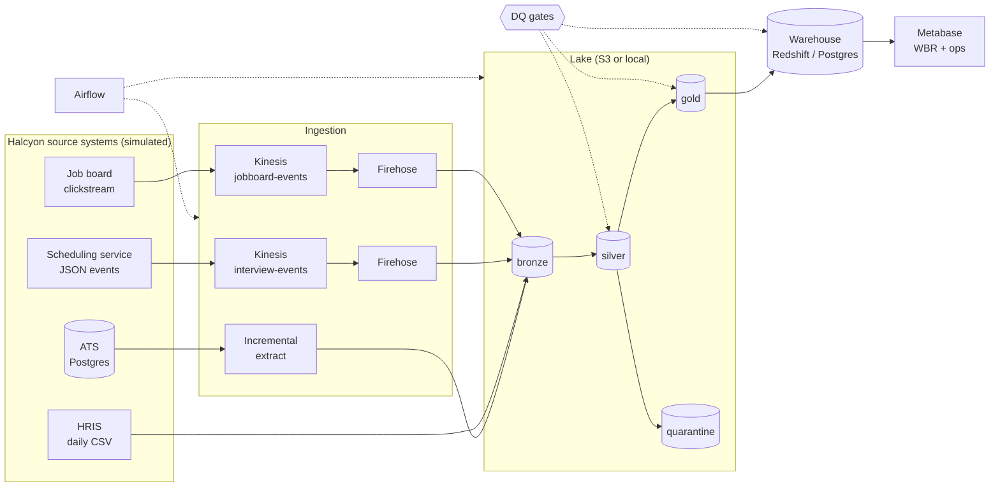

# HireStream — Technical Specification

Version 1.0 · Owner: Shubh Dave (GitHub `logn1602`) · Status: approved for build

> Read together with `CLAUDE.md` (how to work) and `docs/PROGRESS.md` (what's next). Tasks reference sections as §N. Numbers for the simulation live in `config/generator/base.yaml`, not in this document or in code.

---

## 0. Purpose

HireStream simulates the recruiting and internal-mobility systems of **Halcyon**, a fictional 25,000-person company, and builds the data platform a talent / workforce data engineering team would own: collecting events from multiple sources, landing them in a lake, modeling a warehouse, gating on data quality, publishing WBR-style metrics, tuning queries, and deploying to AWS.

### 0.1 Success criteria (v1.0.0)
1. The `full` preset generates **≥ 10 M stream events** plus ATS and HRIS data, with realistic defects, reproducibly from a seed.
2. One command runs the local pipeline end to end; CI runs a `tiny` end-to-end on every PR.
3. The gold model includes an **SCD2 employee dimension**, an **accumulating-snapshot hiring funnel**, an interview fact at interviewer grain, and an employee-movement fact. Metrics reconcile to generator ground truth.
4. A WBR dashboard (6-week + 12-month views) and a pipeline-health dashboard.
5. AWS deployment through CDK (Kinesis, Firehose, S3, EMR Serverless, Redshift Serverless), manual deploy/destroy workflows via GitHub OIDC, and a logged cost per run.
6. `TUNING.md` with at least four measured experiments; `COE-001` with implemented action items.
7. Docs: README, DESIGN (alternatives considered), DATA_MODEL (ERD), METRICS, DQ, RUNBOOK, COST, NOTES, TALKING_POINTS.

### 0.2 Target-role mapping
| Data engineer responsibility | Where HireStream covers it |
|---|---|
| Distributed system collecting and processing log events from multiple sources; automated deployment | Generator sinks → Kinesis → Firehose → bronze; CDK + deploy workflow (§6, §8, §16, §17) |
| Data schema design; data warehouses; SQL/NoSQL systems | Gold star schema, Redshift/Postgres (§10, §11); DynamoDB serving layer (stretch, §23) |
| Metrics, reports, dashboards | `sql/metrics`, Metabase WBR (§13, §14) |
| Monitor and troubleshoot pipelines | DQ framework, alerts, RUNBOOK (§12) |
| Architectural plans | DESIGN.md, ADRs (§21) |
| Automated pipelines processing millions of data points | ≥ 10 M events; Spark on EMR Serverless (§6, §9, §10) |
| Tune inefficient queries | Benchmark harness + experiments (§18) |
| Root-cause and resolve defects | Incident drills, COE-001, NOTES.md (§19) |
| Big-data technologies (Spark, EMR, Hive-style SQL) | PySpark + SparkSQL on EMR Serverless (§3) |

## 1. Scope and non-goals
In scope: everything in §0.1. Out of scope:
- Real personal data of any kind. **No demographic or protected attributes exist anywhere** in the generator, lake, or warehouse — by design.
- Candidate scoring or any ML that ranks people.
- Long-running streaming jobs. Events land in S3 as micro-batches (the trade-off is argued in DESIGN.md).
- Managed Airflow (MWAA), Kubernetes, RDS — cost. Airflow runs locally; the ATS stays a local Postgres "on-prem" source even in cloud mode.
- Dashboard auth or hosting beyond localhost.

## 2. Architecture



### 2.1 Modes
| Concern | `local` | `cloud` |
|---|---|---|
| Stream transport | `FileSink` writes Firehose-style gzip JSONL into `bronze/` | `KinesisSink` → Kinesis Data Streams → Firehose → S3 `bronze/` |
| Lake root | `./data/lake` | `s3://hirestream-lake-<account>-<region>` |
| ATS source | Postgres container `ats-db` | Same local container; extracts land in S3 (hybrid "on-prem source → cloud lake") |
| HRIS drop | Local files into `bronze/hris/` | Generator uploads daily files to S3 `bronze/hris/` |
| Spark | `local[*]` | EMR Serverless |
| Warehouse | Postgres container `warehouse-db` | Redshift Serverless via the Redshift Data API |
| Orchestration | Airflow (docker compose) | Same Airflow; tasks call `hirestream cloud …` |
| Dashboards | Metabase on `warehouse-db` | Metabase stays local; Redshift is used for tuning via the Data API and Query Editor v2 screenshots |
| Alerts | Console (+ optional Slack webhook) | SNS email |

Jobs are identical in both modes; only IO endpoints and the Spark launcher differ. ADR-0003 records every parity gap.

## 3. Stack and versions
Verified in T0.4; the Spark, Java, and Python pins are decided in ADR-0002. Other rows are defaults, verified when their task starts.

| Component | Default | Notes |
|---|---|---|
| Python | 3.11 (uv) | `requires-python = ">=3.11,<3.12"`; matches EMR PySpark support |
| Spark | EMR Serverless `emr-spark-8.1.0` → Spark 4.1.1, JDK 17, ARM64 (**ADR-0002**) | Fallback `emr-spark-8.0.0` (Spark 4.0.2). Local `pyspark==4.1.1`, pinned exactly; pins live in `hirestream.versions`. Spark 4 enables ANSI mode by default |
| Java | 17 | Local and CI |
| Postgres | 16 | `ats-db`, `warehouse-db`, Airflow metadata |
| Airflow | Latest stable 3.x, official image, LocalExecutor | Extended image with JRE 17 + pinned pyspark + project wheel |
| Metabase | Latest OSS image | Bootstrapped via its REST API |
| IaC | AWS CDK v2 (Python) + CDK CLI (Node 22 LTS) | No context lookups, so CI can synth without credentials |
| Python libraries | numpy, faker, orjson, pydantic v2, typer, pyyaml, jsonschema, boto3, psycopg 3, pyarrow | pydantic and typer only outside Spark jobs |
| Quality tooling | pytest, pytest-cov, moto, ruff, mypy, pre-commit, gitleaks | Coverage ≥ 85% (gate from T2.15) |
| AWS region | us-east-1 | Profile `hirestream` (IAM Identity Center) |

## 4. Repository layout
```
hirestream/
├── CLAUDE.md
├── README.md
├── LICENSE                        # MIT
├── pyproject.toml / uv.lock
├── requirements-spark.txt         # pure-Python deps shipped to EMR (keep tiny)
├── Makefile
├── .pre-commit-config.yaml
├── .env.example
├── .claude/                       # settings.json, commands/
├── .github/                       # workflows/, pull_request_template.md
├── config/
│   ├── generator/base.yaml        # presets included
│   ├── pipeline/{local,cloud}.yaml
│   └── dq/checks.yaml
├── contracts/                     # JSON Schemas: <source>/<event_type>.v<N>.json
├── src/hirestream/
│   ├── cli.py                     # Typer app (§5.3)
│   ├── config.py
│   ├── generator/                 # world, workforce, hris, requisitions, jobboard, ats,
│   │                              # scheduling, chaos, delivery, sinks, ground_truth, report
│   ├── ingest/                    # ats_extract, hris_land, bronze_manifest
│   ├── transforms/                # silver_*, dim_*, fct_*, agg_*, common/
│   ├── dq/                        # framework, checks, runners, alerts
│   ├── load/                      # postgres_loader, redshift_loader
│   ├── bench/                     # benchmark harness
│   └── cloud/                     # emr_serverless, redshift_data, s3 (billable entry points)
├── sql/
│   ├── ats_source/                # ATS source DDL (a fixed "vendor" contract)
│   ├── ddl/{postgres,redshift}/
│   ├── merge/
│   ├── metrics/                   # m01_*.sql … m11_*.sql (portable SQL)
│   └── tuning/                    # suite.yaml, experiment DDL variants
├── airflow/                       # Dockerfile, dags/
├── dashboards/metabase_bootstrap.py
├── docker/docker-compose.yml
├── infra/                         # CDK app: app.py, stacks/
├── docs/                          # SPEC, PROGRESS, DESIGN, DATA_MODEL, METRICS, DQ, TUNING,
│                                  # COST, RUNBOOK, NOTES, TALKING_POINTS, decisions/, coe/, img/
└── tests/{unit,integration,e2e,fixtures}/
```

## 5. Configuration, environments, CLI

### 5.1 Environment variables
| Variable | Purpose |
|---|---|
| `HIRESTREAM_ENV` | `local` (default) or `cloud` |
| `HIRESTREAM_LAKE_ROOT` | Overrides the lake root |
| `HIRESTREAM_PII_SALT` | Required. Salt for email hashing; generated locally, never committed |
| `HIRESTREAM_SLACK_WEBHOOK` | Optional alert sink |
| `AWS_PROFILE` | `hirestream` in cloud mode |

Local database passwords live in `.env` (gitignored). `.env.example` documents every key with placeholder values.

### 5.2 Config files
`config/pipeline/{local,cloud}.yaml` hold the lake root, warehouse target, Spark launcher settings (local master, or EMR application id, release, and role ARN resolved at runtime from CDK outputs, never committed), the reprocessing window (default 7 days), and the DQ checks file.

### 5.3 CLI surface (Typer)
```
hirestream generate backfill --preset {tiny,dev,full} [--seed N] [--incident NAME ...]
hirestream generate live-tail --days N [--sink kinesis]
hirestream ingest ats
hirestream ingest hris --date YYYY-MM-DD
hirestream run silver --source {scheduling,jobboard,ats,hris} [--mode {incremental,bulk}]
hirestream run gold [--tables ...] [--reprocess-days 7] [--mode {incremental,full}]
hirestream run pipeline --date YYYY-MM-DD          # full daily chain, local
hirestream dq run --layer {silver,gold,warehouse} --run-id ...
hirestream load --target postgres [--tables ...]
hirestream metrics check-ground-truth --run-id ...
hirestream bench --target postgres --suite sql/tuning/suite.yaml --runs 5
hirestream cloud {deploy,destroy,status,upload-artifacts,submit,load,bench}   # every billable action
```
Every command logs a `run_id` and writes `ops` records. `hirestream cloud …` refuses to run unless `AWS_PROFILE` is set, and prints what it is about to do before doing it.

## 6. Generator — the Halcyon simulation
Parameters: `config/generator/base.yaml`. Code never hard-codes a rate or distribution.

### 6.1 Principles
- **Day-stepped discrete simulation** over `[sim_start, sim_end]`. Each entity (employee, requisition, application, interview) is a small state machine advanced once per simulated day; intra-day timestamps are sampled from diurnal curves.
- **Deterministic.** One `numpy.random.SeedSequence(seed)` spawns an independent child generator per subsystem (world, workforce, requisitions, jobboard, ats, scheduling, chaos, hris_chaos — ADR-0005), keyed by name, so changing one subsystem doesn't reshuffle the others. Faker is seeded. Emission order is deterministic. Same code + preset + seed ⇒ byte-identical outputs (file hashes recorded in the manifest).
- **Memory-bounded streaming output.** Never materialize the full event set. Vectorize the clickstream with numpy; serialize with orjson; use Faker only for person attributes.
- **Special events are fractions of the window** (`at: 0.5`) resolved to concrete dates in the run manifest, so every preset — including CI's `tiny` — exercises every code path.
- **Ground truth is recorded as it is created** (what actually happened, before chaos), so downstream metrics can be verified.

### 6.2 Time model
- `event_ts` — when it truly happened. `sent_ts` — `event_ts` + 0–5 s producer delay. `arrival_ts` — `sent_ts` + chaos delivery lag (§6.8).
- Clickstream: bimodal diurnal curve around the configured local hours of the visitor's location. Interviews: weekdays, business hours in the interviewer's timezone.
- Local bronze files are bucketed by **arrival hour (UTC)**, the way Firehose buckets by arrival.

### 6.3 World and workforce
- Orgs → teams → managers → employees from `org_model`. Every team has a manager at L6 or above; every org has an L8 leader. Levels, role families, and locations follow the configured shares; spans of control come from `span_of_control`. The initial workforce starts in the steady state of the configured dynamics (tenure, time in role, leave); tree, level, and naming rules are in **ADR-0004**.
- Daily hazards (annual rate / 365): attrition (× `attrition_first_year_multiplier` in the first year), promotion (L3–L7 after `promotion_min_days_in_level`), manager-initiated lateral moves, manager changes, location changes, leave. One reorg moves a whole team to another org on a single day (`workforce.reorg.at`).
- Every change to an HRIS field (org, team, level, manager, location, status) sets `job_effective_date`; a share of changes is first exported retroactively (§6.8). Hazard eligibility, one-hazard-per-day, and succession rules: **ADR-0005**.
- Terminated employees stay in snapshots for `terminated_retention_days`, then drop off.
- New hires come **only** from ATS hires. External: a new `employee_id` on the offer's start date with `ats_candidate_id` set. Internal: a job change effective on the start date to the requisition's org, team, role family, and level. This makes cross-source reconciliation exact.

### 6.4 Requisitions
- Opened by backfill (after attrition, with `backfill_probability` and `backfill_open_delay_days`), by growth (to reach `growth_annual`), and as evergreen reqs (`per_1000_headcount`, at least one per preset; open seats replenish monthly; they never close).
- Attributes: title (from role family and level), org, team, location, headcount, hiring manager, recruiter (an employee in the `recruiting` role family), `is_internal_only`.
- Lifecycle: `open` → optional `on_hold` → `filled` (every seat hired) or `cancelled` (random, or after `max_open_days`). When a req closes, active applications that haven't reached `onsite` are rejected with reason `position_filled` or `req_cancelled` after `req_closed_rejection_delay_days`.
- **Popularity** per req ~ Pareto(`pareto_alpha`), normalized to mean 1; evergreen reqs × `evergreen_multiplier`. Popularity multiplies views and direct applications. This is the deliberate join-skew source for §18. Growth plan, go-live pipeline, the popularity cap (`truncate_at`), and lifecycle details: **ADR-0006**.

### 6.5 Job board (clickstream)
- External expected views per open req-day = `base_daily_views_per_open_req` × popularity × seasonality(month) × day-of-week × posting-age decay (half-life; evergreen reqs don't decay).
- Views are grouped into sessions (geometric size, capped), with optional search, home page, saves, `apply_start`, and `apply_submit` per the configured probabilities. `returning_visitor_share` reuses `visitor_id`s.
- Internal: each active employee browses with daily probability `p_employee_browses_per_day`; at or beyond the tenure-in-role threshold, browsing × `browse_multiplier` and applying × `apply_multiplier` (HT3). Internal sessions carry `employee_id`.
- Every `apply_submit` creates an ATS application (`career_site` or `internal`) with the same `application_id` — the cross-source join key.
- Bots: `session_share` of sessions come from a small visitor pool with 30–300 job views and no applies; a quarter use known bot user agents, the rest spoof browsers.
- Schema v2 (`chaos.schema_v2.jobboard_at`) adds `device_type` to `context`.
- Session structure, pacing, referrers, bot pacing, sinks before T1.8, and candidate/application ids: **ADR-0007**.

### 6.6 ATS
- Direct-channel applications (referral, sourced, agency) arrive per req-day at `direct_apps_per_1000_external_views` × that req-day's expected external views, with no clickstream behind them (reconciliation must account for channel).
- Candidates are created on first application; `reapply_probability` of later applications reuse an existing candidate. Internal candidates carry `employee_id`.
- Stage machine: `applied → recruiter_screen → phone_screen → onsite → offer`. At each gate: advance, withdraw, or reject per `p_advance` / `p_withdraw` (external vs internal). `first_gate_channel_multiplier` scales the `applied → recruiter_screen` advance probability (HT2), capped at 0.95.
- Time in `applied` and `recruiter_screen`: lognormal `stage_delay_days` (rejections × `rejection_delay_multiplier`). Time in `phone_screen` and `onsite` is **emergent**: scheduling lead time + reschedules + the wait for all feedback (capped at `feedback_wait_cap_days`) + `interview_stage_decision_delay_days`. Slow feedback therefore slows hiring, on purpose.
- The gate decision is sampled first; interview recommendations are then sampled consistent with it (`recommendation_given_decision`).
- Offers: accept probability = base − `per_day` × max(0, days_to_offer − `threshold_days`), floored at `accept_probability_floor` (HT4). Accepted offers get a start date. `no_start_probability` of accepted offers flip to `no_start` 1–10 days after the start date — a late correction the accumulating snapshot must absorb.
- Writes go to the ATS schema in §7.4. Backfill mode bulk-loads the final state plus the full `application_stage_changes` history with `COPY`; live-tail mode applies daily inserts and updates.
- Interview-stage stand-in until T1.7, offers and seats, how hires join the workforce, no-starts, and the ATS go-live ramp: **ADR-0008**.

### 6.7 Scheduling service
- Entering `phone_screen` schedules one interview; entering `onsite` schedules a loop of 4–5 sessions (same day with `same_day_probability`). From schema v2, a session is a two-person panel with `panel_session_probability_v2` (`interviewer_ids` array).
- Interviewer selection: employees at or above the req's level, same org with `same_org_probability`, weighted by Pareto popularity; the weight is multiplied by `over_cap_weight_multiplier` once the interviewer passes `weekly_soft_cap` that ISO week, so overload still happens.
- Reschedules (≤ `max_times`), cancellations, and no-shows per config. A no-show is rescheduled with `no_show_reschedule_probability`; otherwise the stage decision proceeds without it.
- Feedback latency ~ lognormal(median 18 h, σ 1.0) × `overload_multiplier` if the interviewer is over the soft cap that week (HT1) × `chronic_slow_multiplier` for chronically slow interviewers. `never_submitted_probability` never arrive; `update_probability` are revised later.

### 6.8 Chaos (always on) and incidents (off by default)
Always on, stream sources:
- **Duplicates** (`duplicate_rate`): the same `event_id` delivered again 1 s–6 h later.
- **Delivery lag** mixture (97% ≤ 2 min, 2.7% 1–72 h, 0.3% 1–7 days) → out-of-order and late arrivals.
- **Malformed lines** (`malformed_rate`), split evenly: truncated JSON, a required field removed, an invalid enum value.
- **Timezone bug**: producer `1.3.0`, for 14 days, emits `scheduled_start` / `new_start` / `previous_start` as naive local time; 2% of those also lack `payload.timezone` (unresolvable → quarantine).
- **Schema v2** switches at the configured fractions (§7).

Always on, HRIS: one missing snapshot day; one day that exports `mgr_id` instead of `manager_id`; 10% of job changes exported with a `job_effective_date` 1–14 days in the past; one snapshot with a duplicated employee row. Exact semantics (end-of-day snapshots, retention, late-export merging): **ADR-0005**.

Incidents (`--incident NAME`; used by the drills and COE-001, §19): `duplicate_storm`, `silent_schema_break` (the job board renames `req_id` → `requisition_id` for one day **without** bumping `schema_version`), `late_burst`, `hris_partial_file`.

### 6.9 Sinks and delivery
- A delivery queue (min-heap on `arrival_ts`) sits between the engines and the stream sinks. Events flush as the simulation clock passes their arrival time; only lagged events (~3%) wait in memory.
- `FileSink`: `bronze/<source>/yyyy=YYYY/mm=MM/dd=DD/hh=HH/part-<n>-<uuid>.jsonl.gz` by arrival hour (UTC); roll every `stream_file_max_events`.
- `KinesisSink`: `PutRecords` batches of ≤ 500 records and ≤ 5 MiB; partition key `interview_id` (scheduling) or `session_id` (job board) to keep per-entity order within a shard; retry only the failed records, with exponential backoff and jitter. Unit-tested with moto, including partial failures.
- `PostgresSink` (ATS) and `HrisFileSink` (`bronze/hris/snapshot_date=YYYY-MM-DD/employees_YYYYMMDD.csv.gz`).

### 6.10 Run outputs
Under `<lake>/_runs/<run_id>/`:
- `manifest.json` — preset, seed, config hash, git commit, the resolved special-event calendar, per-file sha256 and counts.
- `ground_truth.json` — realized facts before chaos: hires and offers by month × channel × internal; transfers and promotions by month; feedback latency quantiles overall and by overload flag; realized HT1–HT4 effect sizes; injected duplicates, malformed, and unresolvable counts by source and kind; expected quarantine counts by reason.
- `generation_report.md` — counts per source and event type, calibration results against `calibration_targets` (pass/warn), runtime, peak RSS.

### 6.11 Acceptance
- Determinism: two `tiny` runs with the same seed produce identical file hashes.
- `full` produces ≥ 10 M stream events.
- Calibration within targets at `dev` and `full`, or an ADR explaining a deliberate miss.
- Every emitted event validates against its contract (exhaustively at `tiny`, sampled at `full`).
- `full` targets ≤ 45 min runtime and ≤ 4 GB peak RSS on a 16 GB laptop; record actuals in the README.

## 7. Source contracts
JSON Schemas live in `contracts/<source>/<event_type>.v<N>.json`. They are the single source for generator validation tests and for silver parsing expectations. Contract changes need a version bump and an ADR.

### 7.1 Stream envelope
| Field | Type | Notes |
|---|---|---|
| `event_id` | string (UUIDv4) | Duplicates reuse it |
| `event_type` | string (enum per source) | |
| `schema_version` | int | 1 or 2 |
| `source` | string | `scheduling-service` or `jobboard-web` |
| `producer_version` | string (semver) | `1.3.0` is the timezone-bug build |
| `event_ts` | scheduling: ISO-8601 UTC `Z` string · job board: integer epoch milliseconds | Different on purpose |
| `sent_ts` | ISO-8601 UTC `Z` string | |
| `context` | object (job board only) | `session_id`, `visitor_id`, `employee_id` (nullable), `user_agent`, `referrer_type` (direct, search_engine, social, email, internal_portal); v2 adds `device_type` (desktop, mobile, tablet) |
| `payload` | object | Per event type |

### 7.2 Scheduling-service events
| event_type | Payload fields (v1) | v2 changes |
|---|---|---|
| `interview_scheduled` | `interview_id`, `application_id`, `req_id`, `interview_type` (phone_screen, onsite), `loop_id` (null for phone), `session_index` (null for phone), `interviewer_id`, `scheduled_start` (local ISO-8601 **with offset**), `duration_minutes`, `timezone` (IANA), `coordinator_id` | `interviewer_id` → `interviewer_ids` (array); adds `interview_format` (virtual, in_person) |
| `interview_rescheduled` | `interview_id`, `previous_start`, `new_start` (same rules as `scheduled_start`), `timezone`, `reason` (candidate_conflict, interviewer_conflict, other), `initiated_by` (candidate, interviewer, coordinator) | — |
| `interview_cancelled` | `interview_id`, `reason` (candidate_withdrew, position_filled, interviewer_unavailable, other) | — |
| `interview_completed` | `interview_id`, `actual_start`, `actual_end` (UTC `Z`) | — |
| `interview_no_show` | `interview_id`, `no_show_party` (candidate, interviewer) | — |
| `feedback_submitted` | `feedback_id`, `interview_id`, `interviewer_id`, `recommendation` (strong_hire, hire, no_hire, strong_no_hire), `word_count` | — |
| `feedback_updated` | `feedback_id`, `interview_id`, `interviewer_id`, `recommendation` | — |

`event_ts` is the moment the action occurred (for feedback, the submission time).

### 7.3 Job board events
| event_type | Payload fields |
|---|---|
| `page_view` | `page_type` (home, search_results, job_detail, apply_form, confirmation), `req_id` (nullable) |
| `job_search` | `query_text`, `filter_location` (nullable), `filter_role_family` (nullable), `results_count` |
| `job_view` | `req_id`, `position_in_results` (nullable) |
| `job_save` | `req_id` |
| `apply_start` | `req_id` |
| `apply_submit` | `req_id`, `application_id`, `candidate_id` |

### 7.4 ATS source schema (Postgres database `ats`)
Treat it as a vendor schema: the pipeline adapts to it, never the reverse. Timestamps are `timestamp without time zone` holding UTC — a documented quirk.

| Table | Columns (primary key first) |
|---|---|
| `candidates` | `candidate_id`, first_name, last_name, email, phone, location_city, location_country, is_internal, employee_id, created_at, updated_at |
| `requisitions` | `req_id`, title, role_family, job_level, org, team, location_city, headcount, hiring_manager_id, recruiter_id, status (open, on_hold, filled, cancelled), is_evergreen, is_internal_only, opened_at, closed_at, created_at, updated_at |
| `applications` | `application_id`, candidate_id, req_id, source_channel (career_site, referral, sourced, agency, internal), applied_at, current_stage, status (active, rejected, withdrawn, hired, offer_declined, no_start), status_reason, updated_at |
| `application_stage_changes` | `change_id` (bigserial), application_id, from_stage, to_stage, from_status, to_status, reason, changed_at, changed_by — append-only |
| `offers` | `offer_id`, application_id (unique), extended_at, status (extended, accepted, declined, rescinded), decided_at, start_date, updated_at |

Index every `updated_at`, and `application_stage_changes(change_id)`. DDL: `sql/ats_source/001_schema.sql`; connection, overwrite, constraints, and payload hashes: **ADR-0009**.

### 7.5 HRIS daily snapshot
A full export of all employees (active, on leave, and terminated within the retention window): CSV with header, UTF-8, ISO dates, gzip.

Columns: `snapshot_date, employee_id, first_name, last_name, work_email, hire_date, org, team, role_family, job_level, manager_id, location_city, employment_status (active, leave, terminated), termination_date, job_effective_date, ats_candidate_id`.

## 8. Bronze — raw landing, immutable
```
bronze/
  scheduling/yyyy=…/mm=…/dd=…/hh=…/*.jsonl.gz      # arrival time (UTC), Firehose-style
  jobboard/yyyy=…/mm=…/dd=…/hh=…/*.jsonl.gz
  ats/<table>/extract_ts=YYYYMMDDTHHMMSSZ/*.parquet
  hris/snapshot_date=YYYY-MM-DD/employees_YYYYMMDD.csv.gz
  _firehose_errors/…                                 # cloud only
```
- Bronze is append-only; nothing in it is ever rewritten. In S3 it expires after 30 days.
- **Don't trust hour prefixes to be complete.** Firehose can deliver an object into an hour prefix after that hour has passed. Silver tracks processed objects in `state/bronze_manifest/<source>/` (key, size, mtime/etag, run_id); each run processes unseen objects from a trailing listing window (default 48 h of prefixes; full listing in bulk mode).
- ATS extract (`hirestream ingest ats`): mutable tables are pulled incrementally with `updated_at > watermark − 1 h overlap` (catches in-flight transactions; the resulting duplicates are resolved in silver). `application_stage_changes` is pulled with `change_id > last_max_change_id`. Watermarks in `state/ats_watermarks.json` advance only after the extract is durably written. Known limitation: hard deletes are invisible to watermark extraction (CDC is a stretch goal, §23).
- HRIS landing checks that the file exists, is non-empty, and has a header, then copies it unchanged.

## 9. Silver — cleaned and conformed

### 9.1 Common rules
- Parquet (snappy). Stream tables are partitioned by `event_date` (UTC date of `event_ts`), ATS stage changes by `change_date`, HRIS by `snapshot_date`.
- Lineage columns on every row: `_arrival_ts`, `_source_file`, `_run_id`, `_ingested_at`.
- Read raw lines as text first (`spark.read.text`) so one bad line can be quarantined on its own. Detect malformed JSON explicitly (for example `try_parse_json` on Spark 4, or a corrupt-record column) rather than inferring it from null fields. Parse against the contract schema, validate required fields and enums, and parse timestamps with `try_to_timestamp`. ANSI mode stays on.
- **Quarantine** to `quarantine/<source>/event_date=…/` with `raw_line, reason_code, reason_detail, _source_file, _arrival_ts, _run_id`. Reason codes: `MALFORMED_JSON`, `MISSING_REQUIRED_FIELD`, `INVALID_ENUM`, `UNPARSEABLE_TIMESTAMP`, `UNRESOLVABLE_TIMEZONE`, `UNKNOWN_SCHEMA_VERSION`, `OUT_OF_RANGE_TIMESTAMP`.
- **Dedupe** on `event_id`, keeping the earliest `_arrival_ts` (tie-break on `_source_file`). New rows are anti-joined against existing rows in the affected `event_date` partitions, which are then rewritten with dynamic partition overwrite. Re-running the same window yields identical partitions.
- **Late data**: every run writes `state/touched_partitions/<run_id>.json` (source → the set of `event_date`s it rewrote). Gold consumes this explicitly (§10.5) instead of guessing.
- **v1/v2 unification**: one silver schema per source. Scheduling: `interviewer_ids array<string>` (v1 scalar wrapped in an array), `interview_format` nullable. Job board: `device_type` nullable.
- **Timezone resolution (scheduling)**: offset present → convert to UTC. Naive → interpret in `payload.timezone` with `to_utc_timestamp` (DST policy: ambiguous → earlier offset; nonexistent → shift forward) and set `start_tz_inferred = true`. No timezone → quarantine as `UNRESOLVABLE_TIMEZONE`.
- **PII**: `email_hash = sha2(concat(salt, lower(trim(email))), 256)`. Names and phone numbers are dropped in silver. Bronze keeps the synthetic PII, is readable only by pipeline roles, and expires after 30 days.

### 9.2 Silver tables
| Table | Grain / key | Notes |
|---|---|---|
| `silver.scheduling_events` | one row per `event_id` | Wide, sparse unified table: interview ids, type, loop/session, `interviewer_ids`, `interviewer_id` (feedback events), UTC start / new start / previous start, `start_tz_inferred`, duration, timezone, reason, initiated_by, no_show_party, recommendation, feedback_id, word_count, interview_format, coordinator_id, actual start/end (UTC), schema and producer version, lineage |
| `silver.jobboard_events` | one row per `event_id` | `event_ts_utc` from epoch ms; context fields flattened; payload fields; `query_text` kept here only |
| `silver.ats_candidates`, `ats_requisitions`, `ats_applications`, `ats_offers` | one row per primary key (latest `updated_at` across extracts) | Merged current state; candidates without names or phone, email hashed |
| `silver.ats_stage_changes` | one row per `change_id` | Append-only |
| `silver.hris_snapshots` | one row per (`snapshot_date`, `employee_id`) | Column alias map (`mgr_id` → `manager_id`); identical duplicate rows collapsed; conflicting duplicates quarantined + DQ error; names dropped, email hashed |

## 10. Gold — Kimball model

### 10.1 Conventions
- Surrogate keys: `BIGINT = xxhash64(<natural key parts>)` — deterministic, so rebuilds are idempotent. Every dimension has an unknown member with key `-1`; facts that can't resolve a key get `-1` and are re-resolved when their partitions are reprocessed.
- Date keys are `INT yyyymmdd`; timestamps are UTC; durations are precomputed (`DOUBLE`, days or hours, 2 decimals).
- Physical format: Parquet in `gold/<table>/`; large facts partitioned by date key.

### 10.2 Dimensions
| Table | Type | Key | Attributes |
|---|---|---|---|
| `dim_date` | static | `date_key` | date, ISO year and week, `week_start_date` (Monday), month, quarter, year, `month_start_date`, day_of_week, is_weekend. Range: sim_start − 30 d → sim_end + 365 d |
| `dim_employee` | **SCD2** | `employee_sk` | Type 2: org, team, role_family, job_level, manager_id, location_city, employment_status, termination_date. Type 1: hire_date, email_hash, ats_candidate_id. Plus `employee_id`, `effective_from`, `effective_to` (exclusive; `9999-12-31` when current), `is_current`, `version_number`, `record_hash` |
| `dim_interviewer` | role-playing view over `dim_employee` | `employee_sk` | same as `dim_employee` |
| `dim_requisition` | SCD1 | `requisition_sk` | req_id, title, role_family, job_level, org, team, location_city, headcount, is_evergreen, is_internal_only, status, opened_date, closed_date, hiring-manager and recruiter employee ids, days_open |
| `dim_candidate` | SCD1 | `candidate_sk` | candidate_id, is_internal, employee_id, location_city, location_country, email_hash, first_applied_date — no names |
| `dim_source_channel` | static | `channel_key` | channel, channel_group (inbound: career_site; outbound: sourced, agency; referral; internal) |

### 10.3 SCD2 algorithm — `dim_employee` from daily snapshots
1. Process snapshots in date order; compute `record_hash` over the Type 2 attributes.
2. A change is a hash that differs from the employee's current version.
3. `effective_from` = `job_effective_date` when it is ≤ the snapshot date and later than the current version's `effective_from`; otherwise the snapshot date. (Honors retro changes; clamps impossible dates and emits a DQ warning.)
4. Close the prior version with `effective_to = new effective_from`.
5. First sighting: `effective_from = hire_date` if it is ≤ the snapshot date, else the snapshot date.
6. **Absence never closes a version.** Terminations come only from `employment_status`. Active employees disappearing unexpectedly is a DQ signal (S-HR-04), not a dimension change.
7. Missing snapshot days produce no gaps: changes appear the next day with their true effective dates.
8. Two modes — full rebuild, and incremental (new snapshot dates plus a re-process of the last N days when late or corrected files arrive) — must produce identical tables (tested).

Point-in-time lookup for facts: `effective_from ≤ event_date < effective_to`, resolved **in Spark at fact build**, so warehouse joins are equi-joins on `employee_sk`.

### 10.4 Facts
**`fct_application_pipeline`** — accumulating snapshot, one row per `application_id`.
- Columns: application_id, candidate_sk, requisition_sk, channel_key, is_internal; milestone date keys `applied`, `recruiter_screen`, `phone_screen`, `onsite`, `offer`, `offer_decision`, `start` (nullable except applied; each is the first entry into that stage); current_stage; outcome (in_progress, hired, rejected, withdrawn, offer_declined, no_start); outcome_stage; outcome_reason; lags `days_applied_to_screen`, `days_screen_to_phone`, `days_phone_to_onsite`, `days_onsite_to_offer`, `days_applied_to_offer`, `days_offer_to_decision`, `days_applied_to_accept` (time to hire); interview_count; feedback_pending_count; last_event_ts; row_hash; `_updated_run_id`.
- Build: recompute rows for applications touched in the window (a stage change, offer update, or interview event in touched partitions) from their full history, then MERGE on `application_id` where `row_hash` changed.

**`fct_interview`** — one row per (`interview_id`, interviewer).
- Columns: interview_id, interviewer_employee_sk (point-in-time at the scheduled date), interviewer_employee_id, application_id, requisition_sk, candidate_sk, interview_type, loop_id, session_index, interview_format, original_scheduled_start_utc, scheduled_start_utc (final), scheduled_date_key, reschedule_count, final_status (scheduled, completed, cancelled, no_show_candidate, no_show_interviewer), completed_at_utc, feedback_submitted_at_utc, feedback_latency_hours, feedback_within_24h, feedback_within_48h, feedback_missing (completed with no feedback after 7 days), recommendation (latest), recommendation_updated, interviewer_weekly_load (that interviewer's interviews that ISO week, excluding cancelled), is_overloaded (load > soft cap), start_tz_inferred.
- The grain was chosen so the v2 scalar → array change explodes cleanly: a panel produces two rows, each with its own feedback.

**`fct_jobboard_event`** — one row per deduped event, partitioned by `event_date_key`.
- Columns: event_id, event_ts_utc, event_date_key, event_type, session_id, visitor_id, employee_sk (null for external visitors; `-1` if unresolved), is_internal, requisition_sk (null when the event has no req; `-1` if unresolved), application_id, page_type, referrer_type, device_type, results_count, position_in_results, is_suspected_bot, bot_rule.
- Bot rules (per visitor-day): more than 60 job views in any 10-minute window; or a known bot user agent; or a session with more than 100 job views and no other event types.

**`agg_jobboard_req_daily`** — req × day: views, unique_visitors, internal_views, saves, apply_starts, apply_submits, bot_views_excluded. Bots are excluded from every other measure.

**`fct_employee_movement`** — one row per `dim_employee` version transition, plus hires and terminations.
- Columns: employee_id, movement_date_key, movement_type, from/to org, team, level, manager, location; change flags `org_changed`, `team_changed`, `level_changed`, `manager_changed`, `location_changed`; via_internal_application; application_id; from/to employee_sk.
- Classification, first match wins: `termination` (status → terminated) → `new_hire` (first version) → `reorg_move` (≥ 5 members of one team change org on the same day) → `internal_transfer` (matches an ATS internal hire whose start date is within ± 7 days) → `promotion` (level up) → `lateral_move` (org or team change) → `manager_change` → `location_change`.

**`fct_headcount_monthly`** (added by tuning experiment E5) — periodic snapshot: month × org × team × level × location headcount.

### 10.5 Reprocessing window
Gold rebuilds the affected partitions: touched partitions reported by silver ∪ the trailing 7 days as a safety net. Dimensions rebuild incrementally; facts re-resolve keys against the current dimensions each time.

## 11. Warehouse
- Schemas: `gold` (tables), `staging` (load targets), `ops` (dq_results, pipeline_runs, load_audit), `metrics` (views for dashboards).
- **Local Postgres**: DDL in `sql/ddl/postgres/`; B-tree indexes on foreign keys and date keys to start. Alternatives are tuning experiments, not defaults.
- **Redshift**: DDL in `sql/ddl/redshift/` — a baseline with `DISTSTYLE AUTO` and no explicit sort keys. Tuned variants live in `sql/tuning/`.
- Load protocol per table, in one transaction where supported:
  1. Gold Parquet is final in the lake.
  2. Load into `staging.<table>`. Local: pyarrow scan → psycopg `COPY … FROM STDIN` in batches. Cloud: `COPY … FROM 's3://…' IAM_ROLE … FORMAT AS PARQUET` through the Redshift Data API.
  3. Upsert into `gold.<table>`: `MERGE` on the grain key for dimensions and `fct_application_pipeline`; delete + insert over the touched date range for date-partitioned facts.
  4. Verify row counts (and a column checksum) against the Parquet and write `ops.load_audit`. A mismatch fails the run (X-04).
  5. `ANALYZE` the changed tables.
- Redshift is reached only through the Data API (IAM auth, no public endpoint).
- `metrics` views implement M01–M11 in portable SQL. Dialect-specific variants only when unavoidable, and tested on Postgres in CI.

## 12. Data quality

### 12.1 Framework
Checks are declared in `config/dq/checks.yaml`:
```yaml
- id: S-JB-01
  layer: silver
  table: silver.jobboard_events
  type: unique
  params: { columns: [event_id] }
  severity: error        # warn | error
  blocking: true         # stops downstream publishing for this run
  description: event_id is unique after dedupe
```
- Types: `not_null`, `unique`, `accepted_values`, `null_rate_max`, `row_count_min`, `freshness`, `volume_anomaly` (robust z-score of the day's count against the trailing 28 same-weekday days, using median and MAD), `referential`, `reconciliation`, `expression` (violating-row count ≤ threshold), `cross_source` (SQL that returns violations).
- Results go to `ops/dq_results` (lake) and `ops.dq_results` (warehouse): run_id, check_id, layer, table, partition, status (pass, warn, fail), observed_value, threshold, violations_sample (≤ 20 rows as JSON), executed_at.
- **Circuit breaker**: a failing blocking check fails the Airflow task, so gold isn't published and the warehouse isn't loaded for that run; consumers keep the last good data. Non-blocking failures only alert.
- Alerts: console always; Slack webhook if configured; SNS in cloud. Every alert carries the check id, table, observed value vs threshold, run id, and a RUNBOOK anchor.

### 12.2 Initial catalog (Phase 2)
| ID | Check | Severity / blocking |
|---|---|---|
| S-SCH-01, S-JB-01 | `event_id` unique after dedupe | error / yes |
| S-SCH-02, S-JB-02 | Quarantine rate per run: warn > 0.3%, fail > 1% | error / yes |
| S-SCH-03 | Accepted values (event_type, interview_type, recommendation, reasons) | error / yes |
| S-SCH-04, S-JB-04 | `event_ts` within [sim_start − 1 d, max arrival + 1 d] | error / yes |
| S-SCH-05, S-JB-05 | Freshness: newest arrival within 26 h of the logical date | warn / no |
| S-JB-06 | Daily volume anomaly: warn at z > 3, fail at z > 4 | error / no |
| S-JB-07 | Observed duplicate rate: warn > 3%, fail > 5% | error / no |
| S-ATS-01 | Primary key unique per table | error / yes |
| S-ATS-02 | FK integrity (applications → candidates and requisitions; offers → applications) | error / yes |
| S-ATS-03 | Stage transitions allowed by the state machine | error / yes |
| S-ATS-04 | Watermarks monotonic | error / yes |
| S-HR-01 | Snapshot present for the logical date | warn / no |
| S-HR-02 | Row count vs previous snapshot: warn ± 5%, fail ± 10% | error / yes |
| S-HR-03 | `employee_id` unique per snapshot after identical-row collapse | error / yes |
| S-HR-04 | Active employees missing vs previous snapshot ≤ 0.5% | error / yes |
| S-HR-05 | Expected columns present after alias mapping; unknown columns warn | warn / no |
| G-EMP-01 | Exactly one current version per employee | error / yes |
| G-EMP-02 | No overlapping or gapped validity ranges; `effective_to > effective_from` | error / yes |
| G-APP-01 | One row per `application_id` | error / yes |
| G-APP-02 | Milestones monotonic (applied ≤ screen ≤ … ≤ decision) | error / yes |
| G-APP-03 | Outcome consistent with milestones | error / yes |
| G-INT-01 | (`interview_id`, interviewer) unique | error / yes |
| G-INT-02 | `feedback_latency_hours ≥ 0` | error / yes |
| G-INT-03 | Unresolved interviewer keys (`-1`) ≤ 0.1% | error / no |
| G-JB-01 | Unresolved requisition keys (`-1`) ≤ 0.1% | error / no |
| G-JB-02 | Bot event share ≤ 15% | warn / no |
| X-01 | Bronze rows read = silver written + quarantined + duplicates dropped, per source per run | error / yes |
| X-02 | External hires with start ≤ snapshot − 7 d appear in HRIS (excluding `no_start`) | warn / no |
| X-03 | Internal hires have an `internal_transfer` movement within ± 7 d | warn / no |
| X-04 | Warehouse row counts = gold Parquet row counts | error / yes |

**Deliberately absent until COE-001** (§19): a null-rate check on `req_id` for req-bearing job-board events (ID `S-JB-03` is reserved for it) and an unknown-field drift check against the contracts.

## 13. Metrics
Definitions live in `docs/METRICS.md` (source of truth); SQL lives in `sql/metrics/`. Weeks are ISO weeks (Monday start, UTC).

| ID | Metric | Definition | Cut by |
|---|---|---|---|
| M01 | Time to hire | p50/p90 of `days_applied_to_accept` for hired applications, by offer-decision week | org, role family, level, channel, internal |
| M02 | Time to fill | p50/p90 days from req open to its final accepted offer (non-evergreen filled reqs), by close week | org, role family |
| M03 | Stage conversion | Cohort by applied week; conversion S → S+1 = reached S+1 / reached S; **only cohorts ≥ 60 days old** (right-censoring) | channel, internal, org |
| M04 | Interviewer load | Interviews per interviewer per week (p50/p90/max) and share of interviewers over the soft cap | org |
| M05 | Feedback SLA | Share of completed interviews with feedback ≤ 24 h and ≤ 48 h; median latency | org; overloaded vs not (HT1) |
| M06 | Interview disruption | Reschedule rate, cancellation rate, candidate and interviewer no-show rates | interview type |
| M07 | Offer acceptance | accepted / (accepted + declined), by decision week | internal; days-to-offer bucket ≤ 30, 31–45, 46–60, > 60 (HT4) |
| M08 | Internal fill rate | Hires starting in the month who were internal / all hires starting in the month | org |
| M09 | Internal mobility rate | Internal transfers in the month / average active headcount × 12 (annualized); promotion rate computed the same way | org, level |
| M10 | Job board funnel | views → apply_start → apply_submit (bots excluded); top reqs by views; bot share | internal vs external; device (v2) |
| M11 | Pipeline health | Freshness per source, quarantine rate by reason, duplicate rate, DQ results, load durations | source |

### 13.1 WBR layout
For M01, M03, M05, M07, M08, and M09: a **6-12 chart** (trailing 6 ISO weeks beside trailing 12 months), a KPI tile with the current week and the week-over-week delta, and year-over-year once 12+ months of history exist.

### 13.2 Ground-truth verification
`hirestream metrics check-ground-truth` compares warehouse results with `ground_truth.json`:
- ATS-derived counts (hires, offers accepted and declined by month × channel × internal) match **exactly**.
- Stream-derived counts match within the injected loss (malformed + unresolvable counts).
- Hidden-truth effects are recovered in direction and within bands:
  - HT1: median feedback latency ratio, overloaded / normal ∈ [1.6, 2.4]
  - HT2: first-gate pass ratio, referral / career_site ∈ [1.5, 2.1]
  - HT3: internal applications per employee-month, long / short tenure in role ∈ [2.4, 3.6]
  - HT4: offer acceptance falls monotonically across the days-to-offer buckets

## 14. Dashboards
`dashboards/metabase_bootstrap.py` is idempotent (matches objects by name) and uses the Metabase REST API — verify endpoints against the running version. It completes first-time setup, registers `warehouse-db`, creates native-SQL questions from `sql/metrics/*.sql`, and builds two dashboards:
- **HireStream WBR** — 6-12 charts and KPI tiles for M01, M03, M05, M07, M08, M09, plus M10.
- **Pipeline Health** — M11 and the latest DQ failures.

Screenshots go to `docs/img/`.

## 15. Orchestration (Airflow)
DAGs are thin wrappers over the CLI (`@task.bash` or BashOperator) with 2 retries and exponential backoff, per-task timeouts, and `max_active_runs=1`.
- `hirestream_daily` (daily): ingest_ats, ingest_hris → silver_{scheduling, jobboard, ats, hris} → dq_silver (gate) → gold_dims → gold_facts (touched partitions ∪ trailing 7 days) → dq_gold (gate) → load_warehouse → dq_warehouse (X-04) → refresh_metrics → publish_run_summary (`ops.pipeline_runs`; alert on failure).
- `hirestream_backfill` (manual): bulk mode over a date range. **Must produce the same tables** as day-by-day incremental runs (tested at `tiny`).
- `hirestream_live_tail` (manual): advances the simulation N days in real time (default one simulated day per wall-clock minute) to exercise streaming ingestion.

Image: the official Airflow image + JRE 17 + pinned pyspark + the project wheel. `HIRESTREAM_ENV` selects local or cloud behavior inside the CLI.

## 16. AWS infrastructure (CDK, Python)
Every resource is tagged `project=hirestream`, `owner=logn1602`, `env=demo`. `RemovalPolicy.DESTROY` everywhere and `auto_delete_objects=True` on buckets, so `cdk destroy --all` leaves nothing behind (verify with the Resource Groups Tagging API). No context lookups. **No NAT gateways.**

| Stack | Resources |
|---|---|
| `HirestreamGithubOidc` | GitHub OIDC provider + a deploy role trusted only for `repo:logn1602/hirestream:environment:aws-demo`, allowed to assume the CDK bootstrap roles. Deployed once from the laptop |
| `HirestreamLake` | Lake bucket (block public access, SSE-S3, TLS-only policy; lifecycle expires `bronze/` and `quarantine/` after 30 days; bronze readable only by pipeline roles) and an artifacts bucket |
| `HirestreamStreaming` | Kinesis Data Streams `hirestream-interview-events` and `hirestream-jobboard-events` (provisioned, 1 shard, 24 h retention). A Firehose per stream into `bronze/<source>/yyyy=!{timestamp:yyyy}/mm=!{timestamp:MM}/dd=!{timestamp:dd}/hh=!{timestamp:HH}/`, error prefix using `!{firehose:error-output-type}`, GZIP, buffering 64 MiB / 300 s |
| `HirestreamCompute` | EMR Serverless Spark application (release from ADR-0002; ARM64 if the release supports it; auto-start; auto-stop after 15 min idle; maximum-capacity cap such as 32 vCPU / 128 GB; no pre-initialized capacity) and its job execution role |
| `HirestreamWarehouse` | Minimal VPC (isolated subnets in 3 AZs, an S3 gateway endpoint, no NAT); Redshift Serverless namespace + workgroup (not publicly accessible, minimum base capacity, managed admin password); a **usage limit** on RPU-hours whose breach action stops user queries; an IAM role for `COPY` from `gold/` |
| `HirestreamMonitoring` | SNS topic + email subscription (address passed at deploy time, never committed); AWS Budgets budget (default $20/month, alerts at 50/80/100%); EventBridge rule routing EMR Serverless job failures to SNS |

Cost rules: every billable action goes through `hirestream cloud …`; a written estimate in COST.md precedes the first deploy; every cloud session ends with destroy, and the actual cost from Cost Explorer is logged the next day.

## 17. CI/CD
- `ci.yml` (pull requests and pushes to main): `lint` (ruff check, ruff format --check, mypy); `test` (pytest `-m "not slow"` with coverage on Java 17); `e2e-tiny` (generator tiny → full local pipeline against a Postgres service container → DQ → ground-truth checks; budget ≤ 10 min); `secrets` (gitleaks); `infra` (`cdk synth`, from Phase 4).
- `deploy.yml` and `destroy.yml`: `workflow_dispatch` only; GitHub Environment `aws-demo` with Shubh as the required reviewer; `permissions: id-token: write, contents: read`; `aws-actions/configure-aws-credentials` with the OIDC role (ARN in a repository variable, not hard-coded).
- `main` ruleset: require a pull request, require the status checks (lint, test, secrets, stack; add e2e-tiny in T2.15 and infra in T4.1), block force pushes and deletion, **0 required approvals** (a solo owner can't approve their own PR). Applied in T0.6 from `.github/rulesets/main.json` (see RUNBOOK → Branch protection).

## 18. Performance tuning

### 18.1 Harness
`hirestream bench --target {postgres,redshift} --suite sql/tuning/suite.yaml --runs 5` runs 1 warm-up plus 5 measured runs per query, turns the Redshift result cache off (`SET enable_result_cache_for_session TO off`), and records client elapsed time plus engine stats: Postgres `EXPLAIN (ANALYZE, BUFFERS, FORMAT JSON)`; Redshift Serverless `SYS_QUERY_HISTORY` / `SYS_QUERY_DETAIL` (STL/SVL views aren't available on Serverless). Results CSVs go to `docs/tuning/results/`; summary tables are appended to TUNING.md. Always use the `full` dataset, the same capacity, and freshly analyzed tables.

### 18.2 Benchmark queries
Q1 time to hire by org, 12 months · Q2 job-board funnel per req per day, 18 months (heavy) · Q3 feedback latency by load bucket with interviewer attributes · Q4 monthly internal-mobility rate (headcount denominator via a range join) · Q5 top 50 reqs by views, last 30 days · Q6 cohort stage conversion (window functions).

### 18.3 Experiments
Each experiment: hypothesis → one change → median and p90 before/after → plan evidence → keep or revert. One `perf:` commit per experiment.

| ID | Experiment | Target |
|---|---|---|
| E1 | Sort key on `fct_jobboard_event(event_date_key)`, then compound with `requisition_sk` | Redshift Q2, Q5 |
| E2 | `DISTKEY(requisition_sk)` on the event fact + `DISTSTYLE ALL` on small dimensions; confirm redistribution steps disappear from EXPLAIN | Redshift Q2 |
| E3 | Materialized view for the daily req funnel vs the `agg_` table | Redshift Q2 |
| E4 | Point-in-time keys resolved in Spark vs a range join in the warehouse | Q3 |
| E5 | `fct_headcount_monthly` periodic snapshot vs a range join | Q4 |
| E6 | Postgres: B-tree vs BRIN on the event date vs monthly declarative partitioning | Postgres Q2, Q5 |
| E7 | Small-file compaction (Firehose output → 128–512 MB files): file counts and job runtime | Spark |
| E8 | Skewed join on evergreen mega-reqs: AQE off vs AQE on vs salting, with Spark UI task-duration evidence | Spark |
| E9 | Partition pruning on silver reads with and without date predicates | Spark |

v1.0.0 needs at least four completed experiments with measured numbers.

## 19. Incident drills and COE
- **Drills (Phase 3, documented in RUNBOOK)**: `late_burst` — corrections flow through the reprocessing window; `hris_partial_file` — S-HR-02 and S-HR-04 trip the circuit breaker and nothing is published.
- **COE-001 (Phase 5)**: run `silent_schema_break` at `dev` against the Phase 2 catalog. The renamed field parses as a *valid* event with `req_id = null`, so nothing is quarantined and the key-coverage checks pass (null is not the same as unresolved) — the job-board funnel silently loses a day of attribution. Capture the impact, write `docs/coe/COE-001-silent-schema-break.md`, implement the action items (S-JB-03 null-rate check on `req_id` for req-bearing events; an unknown-field drift check against the contracts; a producer contract test), backfill the affected partitions, and show the metrics restored.
- COE template: Summary · Impact (who, what, how long) · Timeline (UTC) · Detection · Root cause (5 Whys) · What went well / what didn't · Action items (owner, priority, status, PR) · Lessons · Appendix (queries, charts).

## 20. Testing
- **Unit**: distributions (sampled medians within tolerance); state machines (only allowed transitions); chaos rates; sinks (moto Kinesis with partial failures); contracts (every sample validates); silver (one fixture per quarantine reason, DST edge cases, dedupe across batches, v1/v2 unification); SCD2 (fixture sequences: change, retro change, missing day, duplicate row, renamed column, termination, rehire); accumulating snapshot (out-of-order stage changes, a late offer update, the `no_start` correction); `fct_interview` (panel explode, reschedules, cancellations, missing feedback); movement classification; every DQ check type; metric SQL on Postgres fixtures.
- **Idempotency**: every job run twice → identical output hashes. Bulk vs incremental equality at `tiny`.
- **End to end**: `tiny` in CI on every PR; `dev` locally (marked `slow`).
- **Coverage**: ≥ 85% on `src/hirestream`, excluding `infra/`; reported from T0.2, enforced from T2.15.

## 21. Documentation deliverables
| File | Content |
|---|---|
| README.md | Pitch, architecture diagram, results with real numbers, screenshots, 3-command quickstart, repo tour, limitations, next steps, "synthetic data — no real people" note |
| DESIGN.md | Narrative design doc with the alternatives considered and why each was rejected |
| DATA_MODEL.md | ERD (Mermaid), grains, keys, SCD rules |
| METRICS.md | Metric definitions (§13) |
| DQ.md | Framework and catalog |
| TUNING.md | Methodology and experiment write-ups |
| COST.md | Estimate, then actual cost per run |
| RUNBOOK.md | Alert → diagnosis → fix; drills; cloud deploy and destroy |
| NOTES.md | Honest engineering log: date, problem, symptom, root cause, fix, lesson |
| TALKING_POINTS.md | Per phase: decisions, trade-offs, numbers, likely interview questions with answers; a Leadership Principles story map |
| decisions/ | ADRs (`NNNN-title.md`: context, decision, alternatives, consequences) |
| coe/ | COE write-ups |

## 22. Glossary
- **Accumulating snapshot** — one row per process instance; milestone dates fill in as it progresses.
- **SCD Type 2** — a new row per change, with a validity range.
- **Role-playing dimension** — one dimension used in several roles (an employee as interviewer).
- **Periodic snapshot** — state captured at fixed intervals.
- **Right-censoring** — recent cohorts haven't had time to convert yet.
- **Point-in-time join** — joining to the dimension version valid when the event happened.
- **Circuit breaker** — a failing gate stops publishing.
- **WBR 6-12 chart** — trailing 6 weeks beside trailing 12 months.
- **COE** — Correction of Error, Amazon's postmortem format.
- **Medallion** — bronze (raw) → silver (clean) → gold (modeled).

## 23. Stretch (Phase 6 — pick at most two, ask first)
- DynamoDB "current candidate status" table fed by a Lambda on the interview stream (NoSQL serving layer).
- Debezium CDC for the ATS (captures deletes and intermediate states), compared with watermark extraction.
- Iceberg tables + Athena for the lake (MERGE in the lake; cost comparison with Redshift).
- Deequ-based checks (Amazon's open-source data-quality library) alongside the custom framework, if version-compatible.
